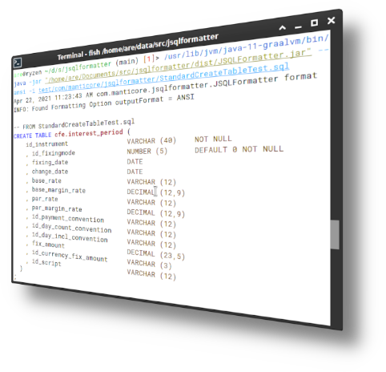

<div align="center">

# JSQLFormatter

### Turn unreadable SQL into something you'd actually want to review.

A platform-independent SQL formatter, beautifier and pretty printer for the JVM — RDBMS agnostic, comment preserving, and driven entirely by the SQL grammar rather than regular expressions.

[](https://github.com/manticore-projects/jsqlformatter/actions/workflows/gradle.yml)
[](https://mvnrepository.com/artifact/com.manticore-projects.jsqlformatter/jsqlformatter)
[](https://app.codacy.com/gh/manticore-projects/jsqlformatter/dashboard?utm_source=gh&utm_medium=referral&utm_content=&utm_campaign=Badge_grade)
[](https://coveralls.io/github/manticore-projects/jsqlformatter)
[](https://github.com/JSQLParser/JSqlParser)
[](#license)
[](https://github.com/manticore-projects/jsqlformatter/issues)
[](http://makeapullrequest.com)

**[Try the online demo](http://jsqlformatter.manticore-projects.com)** &nbsp;·&nbsp;
**[Documentation](http://manticore-projects.com/JSQLFormatter/index.html)** &nbsp;·&nbsp;
**[Samples](http://manticore-projects.com/JSQLFormatter/samples.html)** &nbsp;·&nbsp;
**[Changelog](http://manticore-projects.com/JSQLFormatter/changelog.html)**



</div>

---

## What's new in 5.4

**A complete Visitor Pattern rewrite.** The formatter used to be one long procedural pass with roughly seventy `instanceof` checks deciding what to render. That is gone. Statements and expressions are now dispatched through JSQLParser's own visitor interfaces:

| Component | Responsibility |
|---|---|
| `StatementFormatter` | Dispatches `SELECT`, `INSERT`, `MERGE`, `UPDATE`, `DELETE`, DDL and session statements |
| `ExpressionFormatter` | Renders the full expression tower — operators, functions, `CASE`, sub-selects, literals |
| `Renderer` | Shared spelling, indentation and keyword-casing primitives |

Two things fall out of this. Adding support for a new node type is now a single `visit(...)` override instead of another branch in a growing `if`-chain. And every node type that *isn't* explicitly handled still formats sensibly: a keyword-aware fallback walks the node's own output, applies your configured keyword spelling to uppercase token runs, and passes quoted literals through untouched. No more raw, unformatted islands in the middle of an otherwise clean statement.

**Built on JSQLParser 5.3.242**, which brings massive parsing performance improvements. See [jsqlparser-bench](https://github.com/manticore-projects/jsqlparser-bench) for the numbers.

---

## Install

### Maven

```xml
<dependency>
    <groupId>com.manticore-projects.jsqlformatter</groupId>
    <artifactId>jsqlformatter</artifactId>
    <version>5.4</version>
</dependency>
```

### Gradle

```groovy
dependencies {
    implementation 'com.manticore-projects.jsqlformatter:jsqlformatter:5.4'
}
```

<details>
<summary><b>Snapshot builds</b></summary>

```groovy
repositories {
    maven { url = uri('https://central.sonatype.com/repository/maven-snapshots/') }
}

dependencies {
    implementation 'com.manticore-projects.jsqlformatter:jsqlformatter:5.5-SNAPSHOT'
}
```

</details>

Standalone JARs and native binaries are on the [download page](http://manticore-projects.com/JSQLFormatter/install.html).

---

## Use it

### From Java

```java
import com.manticore.jsqlformatter.JSQLFormatter;

String formattedSql = JSQLFormatter.format("SELECT * FROM table1");
```

### From the command line

```shell
# format a file, ANSI highlighted, straight to the terminal
java -jar JSQLFormatter.jar -i queries.sql --ansi

# reformat a whole folder into a target file, 2-space indent, lowercase keywords
java -jar JSQLFormatter.jar -i ./sql/ -o formatted.sql -2 --keywordSpelling LOWER
```

<details>
<summary><b>Full CLI reference</b></summary>

```shell
java -jar JSQLFormatter.jar [-i <arg>] [-o <arg>] [-f <arg> |
       --ansi | --html]   [-t <arg> | -2 | -8]   [--keywordSpelling <arg>]
       [--functionSpelling <arg>] [--objectSpelling <arg>] [--separation
       <arg>] [--squareBracketQuotation <arg>]

 -i,--inputFile <arg>               The input SQL file or folder.
 -o,--outputFile <arg>              The out SQL file for the formatted
                                    statements.
 -f,--outputFormat <arg>            The output-format.
                                    [PLAIN* ANSI HTML RTF]
    --ansi                          Output ANSI annotated text.
    --html                          Output HTML annotated text.
 -t,--indent <arg>                  The indent width.
                                    [2 4* 8]
 -2                                 Indent with 2 characters.
 -8                                 Indent with 8 characters.
    --keywordSpelling <arg>         Keyword spelling.
                                    [UPPER*, LOWER, CAMEL, KEEP]
    --functionSpelling <arg>        Function name spelling.
                                    [UPPER, LOWER, CAMEL*, KEEP]
    --objectSpelling <arg>          Object name spelling.
                                    [UPPER, LOWER*, CAMEL, KEEP]
    --separation <arg>              Position of the field separator.
                                    [BEFORE*, AFTER]
    --squareBracketQuotation <arg>  Interpretation of square brackets.
                                    [AUTO*, YES, NO]
```

</details>

### Options at a glance

| Option | Values | Default |
|---|---|---|
| `indentWidth` | `2`, `4`, `8` | `4` |
| `keywordSpelling` | `UPPER`, `LOWER`, `CAMEL`, `KEEP` | `UPPER` |
| `functionSpelling` | `UPPER`, `LOWER`, `CAMEL`, `KEEP` | `CAMEL` |
| `objectSpelling` | `UPPER`, `LOWER`, `CAMEL`, `KEEP` | `LOWER` |
| `separation` | `BEFORE`, `AFTER` | `BEFORE` |
| `squareBracketQuotation` | `AUTO`, `YES`, `NO` | `AUTO` |
| `outputFormat` | `PLAIN`, `ANSI`, `HTML`, `RTF` | `PLAIN` |

---

## Samples

### Options travel with the SQL

Drop a `@JSQLFormatter(...)` directive into a comment and the statements below it are formatted to those rules. Different statements in the same file can use different conventions — useful when one repository serves several house styles.

```sql
-- @JSQLFormatter(indentWidth=8, keywordSpelling=UPPER, functionSpelling=CAMEL, objectSpelling=LOWER, separation=BEFORE)
UPDATE cfe.calendar
SET     year_offset = ?                    /* year offset */
        , settlement_shift = To_Char( ? )  /* settlement shift */
        , friday_is_holiday = ?            /* friday is a holiday */
        , saturday_is_holiday = ?          /* saturday is a holiday */
        , sunday_is_holiday = ?            /* sunday is a holiday */
WHERE id_calendar = ?
;

-- @JSQLFormatter(indentWidth=2, keywordSpelling=LOWER, functionSpelling=KEEP, objectSpelling=UPPER, separation=AFTER)
update CFE.CALENDAR
set YEAR_OFFSET = ?                    /* year offset */,
    SETTLEMENT_SHIFT = to_char( ? )    /* settlement shift */,
    FRIDAY_IS_HOLIDAY = ?              /* friday is a holiday */,
    SATURDAY_IS_HOLIDAY = ?            /* saturday is a holiday */,
    SUNDAY_IS_HOLIDAY = ?              /* sunday is a holiday */
where ID_CALENDAR = ?
;
```

### Comments survive, wherever they are

Comments are anchored to the node they belong to, not to a line number — including comments wedged between keywords, inside join conditions, or spanning several lines. String literals that merely *look* like comments are left alone.

```sql
-- BOTH CLAUSES PRESENT 'with a string' AND "a field"
MERGE /*+ PARALLEL */ INTO test1 /*the target table*/ a
    USING all_objects      /*the source table*/
        ON ( /*joins in()!*/ a.object_id = b.object_id )
-- INSERT CLAUSE
WHEN /*comments between keywords!*/ NOT MATCHED THEN
    INSERT ( object_id     /*ID Column*/
                , status   /*Status Column*/ )
    VALUES ( b.object_id
                , b.status )
/* UPDATE CLAUSE
WITH A WHERE CONDITION */
WHEN MATCHED THEN          /* Lets rock */
    UPDATE SET  a.status = '/*this is no comment!*/ and -- this ain''t either'
    WHERE   b."--status" != 'VALID'
;
```

[More samples →](http://manticore-projects.com/JSQLFormatter/samples.html)

---

## Features

- **Grammar driven.** Built on [JSQLParser](https://github.com/JSQLParser/JSqlParser). The SQL is genuinely parsed into an AST before anything is printed, so the formatter understands structure rather than guessing at it.
- **RDBMS agnostic.** Oracle, SQL Server, MySQL/MariaDB, PostgreSQL, H2, DuckDB, BigQuery, Redshift, Databricks and Snowflake dialects, from one grammar.
- **Broad statement coverage.** Complex `SELECT`, `INSERT INTO`, `MERGE`, `UPDATE`, `DELETE`, `CREATE` and `ALTER`, including `WITH` clauses, nested sub-selects, Oracle `(+)` joins and PostgreSQL `::` casts.
- **Syntax highlighting.** ANSI for the terminal, HTML and RTF for documents and wikis.
- **Round-trips through Java code.** Import a SQL string out of Java source while preserving variables, then export it back as a `String`, `StringBuilder` or `MessageFormat` with the parameters intact.
- **Configurable everywhere.** Indent width, comma placement and keyword/function/object casing, set per invocation, per file, or per statement.

## Platforms

| Target | Notes |
|---|---|
| Java library | JAR from Maven Central |
| CLI | Executable JAR |
| Native binary | Static binary or shared library for Linux, Windows and macOS |
| NetBeans plugin | Eclipse, JEdit, Squirrel SQL and DBeaver planned |

---

## Contributing

Issues and pull requests are welcome. If you hit a statement that formats badly, the most useful bug report is the smallest SQL snippet that reproduces it, plus the options you used — that turns straight into a test case.

## Related projects

- **[JSQLParser](https://github.com/JSQLParser/JSqlParser)** — the SQL parser this is built on
- **[JSQLTranspiler](https://manticore-projects.com/JSQLTranspiler/index.html)** — dialect rewriting, column resolution and lineage

## License

Released under the **GNU Affero General Public License v3.0**. See [LICENSE](LICENSE) for the full text.

<div align="center">
<sub>Built and maintained by <a href="https://manticore-projects.com">Manticore Projects</a></sub>
</div>